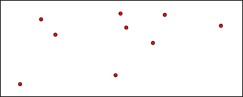
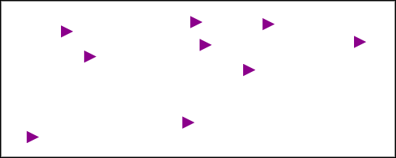

## **Marker Symbolizer**
The Simple Marker symbolizer draws a predefined shape with customizable fill and outline. This is default symbolizer for 0-dimensional geometries (points). 

Supported shapes are:

||Circle| ||Star|
| :- | :- | :- | :- | :- |
||Square| ||Cross|
||Triangle| ||X|

Supported styling options:

|**Property**|**Description**|
| :- | :- |
|[ShapeType](https://apireference.aspose.com/gis/net/aspose.gis.rendering.symbolizers/simplemarker/properties/shapetype)|Specifies the shape of the marker.|
|[Size](https://apireference.aspose.com/gis/net/aspose.gis.rendering.symbolizers/simplemarker/properties/size)|Specifies the size of the marker shape|
|[FillColor](https://apireference.aspose.com/gis/net/aspose.gis.rendering.symbolizers/simplemarker/properties/fillcolor)|Specifies the color and transparency given to the fill|
|[StrokeColor](https://apireference.aspose.com/gis/net/aspose.gis.rendering.symbolizers/simplemarker/properties/strokecolor)|Specifies the color and transparency given to the line|
|[StrokeWidth](https://apireference.aspose.com/gis/net/aspose.gis.rendering.symbolizers/simplemarker/properties/strokewidth)|Specifies the width of the line|
|[StrokeLineJoin](https://apireference.aspose.com/gis/net/aspose.gis.rendering.symbolizers/simplemarker/properties/strokelinejoin)|Determines how lines are rendered at intersections of line segments.|
|[StrokeStyle](https://apireference.aspose.com/gis/net/aspose.gis.rendering.symbolizers/simplemarker/properties/strokestyle)|Specifies how the symbol linework should be drawn.|
|[StrokeDashPattern](https://apireference.aspose.com/gis/net/aspose.gis.rendering.symbolizers/simplemarker/properties/strokedashpattern)|Specifies an array of distances that specifies the lengths of alternating dashes and spaces in dashed lines.|
|[StrokeDashOffset](https://apireference.aspose.com/gis/net/aspose.gis.rendering.symbolizers/simplemarker/properties/strokedashoffset)|Specifies the distance from the start of a line to the beginning of a dash pattern.|
|[Rotation](https://apireference.aspose.com/gis/net/aspose.gis.rendering.symbolizers/simplemarker/properties/rotation)|Specifies the rotation of the symbol about its center point, in decimal degrees. Positive values indicate rotation in the clockwise direction, negative values indicate counter-clockwise rotation. Default is 0.|
|[HorizontalOffset](https://apireference.aspose.com/gis/net/aspose.gis.rendering.symbolizers/simplemarker/properties/horizontaloffset)|Specifies horizontal offset from a point location  to the shape anchor point.|
|[VerticalOffset](https://apireference.aspose.com/gis/net/aspose.gis.rendering.symbolizers/simplemarker/properties/verticaloffset)|Specifies vertical offset from a point location to the shape anchor point.|
|[HorizontalAnchorPoint](https://apireference.aspose.com/gis/net/aspose.gis.rendering.symbolizers/simplemarker/properties/horizontalanchorpoint)|Specifies which side of a marker shape will be aligned horizontally with the point location.|
|[VerticalAnchorPoint](https://apireference.aspose.com/gis/net/aspose.gis.rendering.symbolizers/simplemarker/properties/verticalanchorpoint)|Specifies which side of a marker shape will be aligned vertically with the point location.|
#### **Geometry Types**
` `The symbolizer can be applied to geometries of any type.

|**Geometry Dimension**|**Geometry Types**|**Rendering Behavior**|
| :-: | :-: | :-: |
|**Point**|Point, MultiPoint|Draws the shape centered at the point coordinate.|
|**Line**|LineString, CircularString, CompoundCurve, LinerRing, MultiCurve, MultiLineString|
Draws the shape centered at the centroid of the geometry

 
|
|**Surface**|Polygon, CurvePolygon, MultiPolygon, MultiSurface||

For GeometryCollections, the rendering behavior is determined separately for each geometry inside the collection. Layers with Mixed geometry type follow the logic for GeometryCollections.

Use MixedGeometrySymbolizer to limit a symbolizer to specific geometry types.

### **Examples**
By default the marker symbolizer draws black circles:

-----
Here's how to change fill color to red:

|||
| :- | :- |

-----

Another example of styling with a predefined shape (triangle):

|||
| :- | :- |

-----
For more advanced scenarios, you might want to adjust the marker style dynamically based on feature attribute values. Here's how to do that:

|||
| :- | :- |

-----
You might also want to add labels to your markers. Visit [Points Labeling Examples](/gis/net/simple-labeling/#simplelabeling-pointslabelingexamples) for examples.

